# Lab Report 5: Debugging and Reflection 
This lab report will go over on how to debug an error in a coding scenario and reflecting on the course's lab experience. 

## **Debugging Scenario**
### Student Post: 
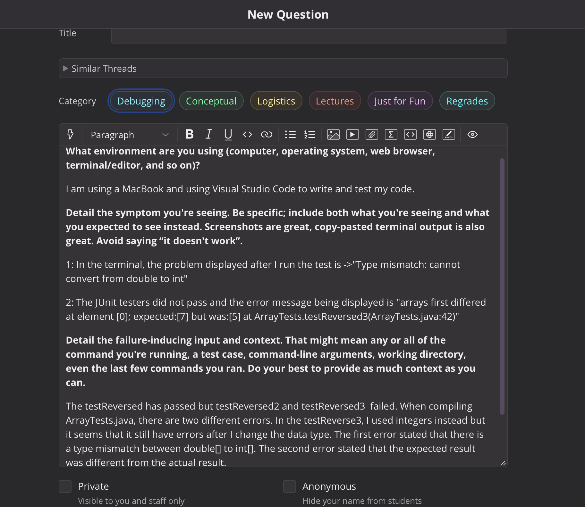

### **Errors/Symptoms**
***Reversed Method From ArrayExamples.java file*** <br />
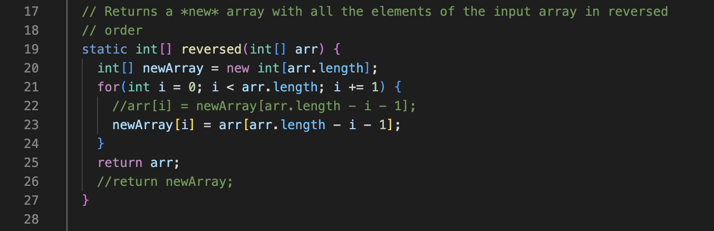

#### **Tests in JUnit** <br />
1. Error in testReversed2 <br />
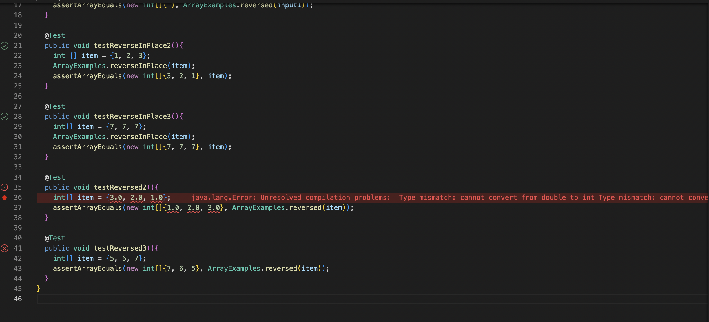

2. Error in testReversed3 <br />
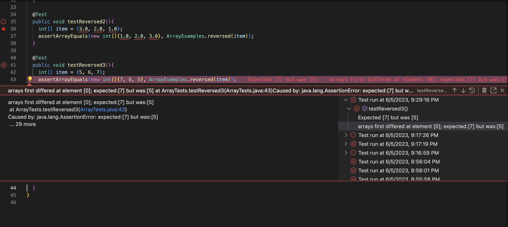

#### **Problem: Error Message in JUnit Testing** <br />
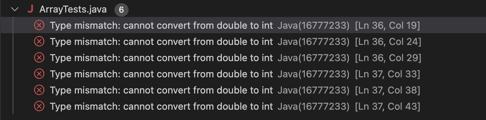

#### **Output In the Terminal:** <br />
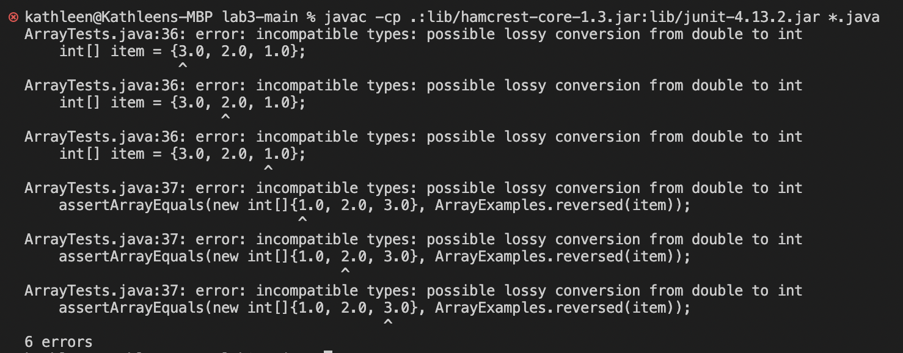

### **Student's Post Analysis**
After observing the code and screenshots of the student's error, the symptom, bug, and failure-inducing inputs are found. 
- [ ] **Symptom:** 1: There is a type mismatch as the method reversed cannot convert the data input from a double[] to int[]. 2: The expected output does not match the actual output after the method reversed is being called. 
- [ ] **Bug:** The bug stems from line 25.
- [ ] **Failure-Inducing Input:** comes from the tester file of JUnit in the testReversed 2 and testReversed3. 

### **Response from a TA:** 
The Problem: After checking your reversed method in ArrayExamples.java, it is true that this method takes in inputs in the type of an integer array only as your parameter has stated ```int[] arr```. In addition, your return statement is returning the wrong array in line 25 within the reversed method. 

#### **Resolution:**
1. **First Error:** you have passed in the wrong argument for reversed method. Because your reversed method in ArrayExamples.java stated that the parameter is `int[]` as its type, the elements of `{3.0, 2.0, 1.0}` are all doubles. Instead, try `{3, 2, 1}` and make sure to also change the element type in your expected value when calling assertArrayEquals. <br /> 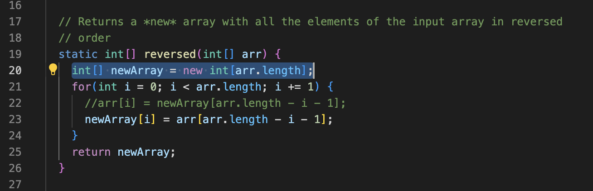
2. **Second Error:** Regarding the second error, the arguments you passed inside the testReverse2 were elements of a double. In line 25,  Although you have changed the error in the for loop to assign the new elements of the newly created that is named as `newArray` to hold elements from the condition embedded for the input array `arr`, you did not update the return statement outside of the for loop. Instead of `return arr` in line 25, you should change it to `return newArray` as it is the newly created int[] that holds the elements in the order that the method has intended to do. <br /> 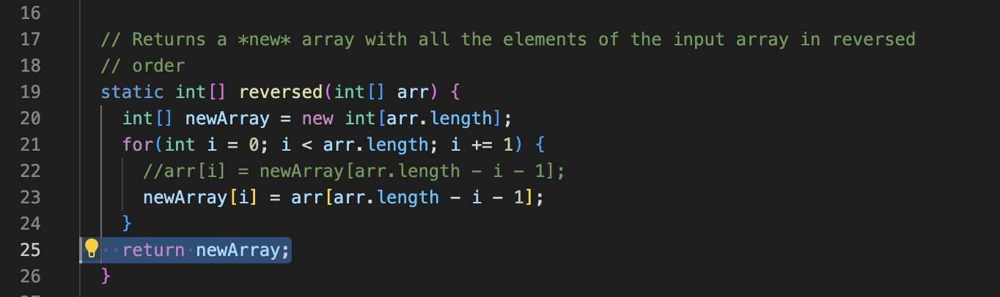

### **After Debugging** 
After compiling the tests again using JUnit commands: 
```java
$ javac -cp .:lib/hamcrest-core-1.3.jar:lib/junit-4.13.2.jar *.java
$ java -cp .:lib/hamcrest-core-1.3.jar:lib/junit-4.13.2.jar org.junit.runner.JUnitCore ArrayTests
```
the tests have all passed as shown in the terminal output. <br /> 
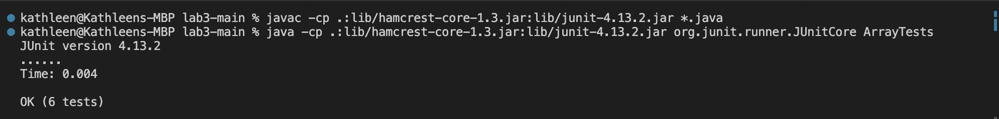

The JUnit tests have passed within the code as well, with the errors now being solved. <br />  
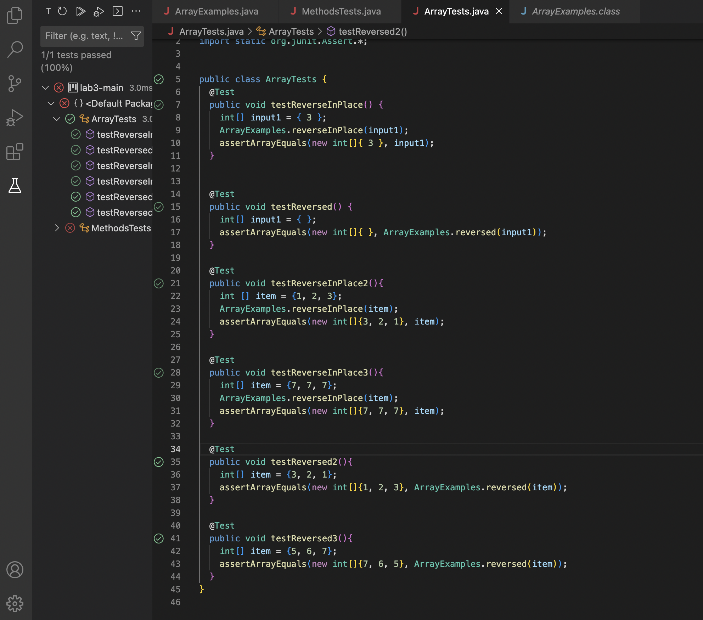

### **Information For SetUp:**
#### **File/Directory:** 
* The directory that was used is from `/GitHub/lab3`
* Two java files that will help approach this problem is ArrayExamples.java and ArrayTests.java for the setup. 
  * `ArrayExamples.java`: This file has the methods that was called when testing in the ArrayTests.java, specifically reverseing methods. 
  * `ArrayTests.java`: This file has all the testers, implementing different testing scenarios to see if the reverse methods from ArrayExamples.java induce the correct expected output as intended. 

#### **Related Contents of Errors:** 
* ArrayExamples.java file containing reversed method to debug <br /> 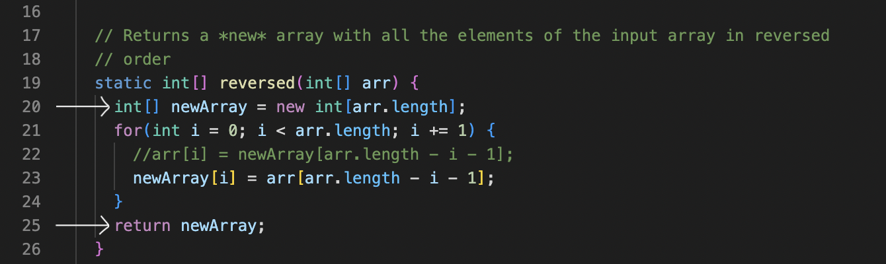
* Errors in the specific tests within ArrayTests.java <br /> 

#### **Compile/Commands**
* Compiling the files with JUnit commands 
```java
$ javac -cp .:lib/hamcrest-core-1.3.jar:lib/junit-4.13.2.jar *.java
``` 
which then produces the errors in the tests (failed). 

#### **Approach to the Problem**
1. The argument being passed in for testReversed2 within ArrayTests.java should be integer type instead of double type in lines 35 and 36. Also, the reversed method in ArrayExamples.java should return newArray in line 25. 
   * ##### **Error:** 
      **1st Problem: Type Mismatch** <br />
      Line 35
      ```java
      int[] item = {3.0, 2.0, 1.0}; 
      ```
      Line 36
      ```java
      assertArrayEquals(new int[]{1.0, 2.0, 3.0}, ArrayExamples.reversed(item));
      ```
      **2nd Problem: Tests Failed** 
      Line 25
      ```java
      return arr; 
      ```
   * ##### **Resolve:** <br />
     -[✔️ ] Solution to 1st Problem: 
     <br />
     Line 35
     ```java
     int[] item = {3, 2, 1}; 
     ```
     Line 36
     ```java
     assertArrayEquals(new int[]{1, 2, 3}, ArrayExamples.reversed(item));
     ```
     -[✔️ ] Solution to 2nd Problem: 
     <br />
     Line 25
      ```java
      return newArray; 
      ```
    <br />
    
    
  
## **Reflection**
Something that have always been helpful for me was learning the different shortcut linux commands. It is very useful when I code as I can easily see where I am at and how I can see contents of a specific file just by inputting certain commands into the terminal. For example in this lab assignment, I was not able to run any of my files for the lab 3 folder. However, I used what I learned in class and did: 
1. cd
2. ls 
3. cd Downloads 
4. cd lab3-main
5. ls 

Then after these commands, I was able to run my ArrayTests.java. This is a longer approach due to the reason that I download the zip file from GitHub instead of using the existing file from GitHubt deskstop that I already have created and altered for lab 3's week. 

This inspired me to learn more commands because it is very time efficient when I can just do things straight from the terminal instead of closing and opening tabs and doing a lot of clicking with my track pad. Several of very useful commands that I have used are: 
* mv command 
   * This command allows you to rename a file. 
   * Correct syntax: `mv old_filename.txt new_filename.txt`
* locate command 
   * This command allows you to find any file in the database. By using -i after the command will help with case sensitivity.
   * Correct syntax: `locate -i to_Find` if you are searching with one word, `locate -i to_Find*to_Find` if you are searching using two words 
* du command 
   * This command allows you to see the amount of space a file or a directory takes up. 
   * Correct syntax: `du /home/user/Documents`
   * Using -m will provide the information for the folder and file in MB 
   * Using k will display the information in KB 
   * Using -h will show the last time stamp the folders and files were modified 
